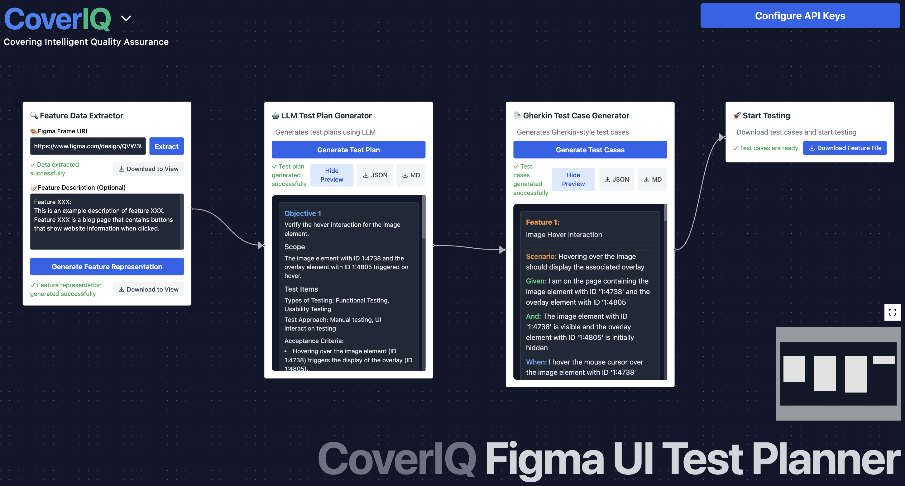
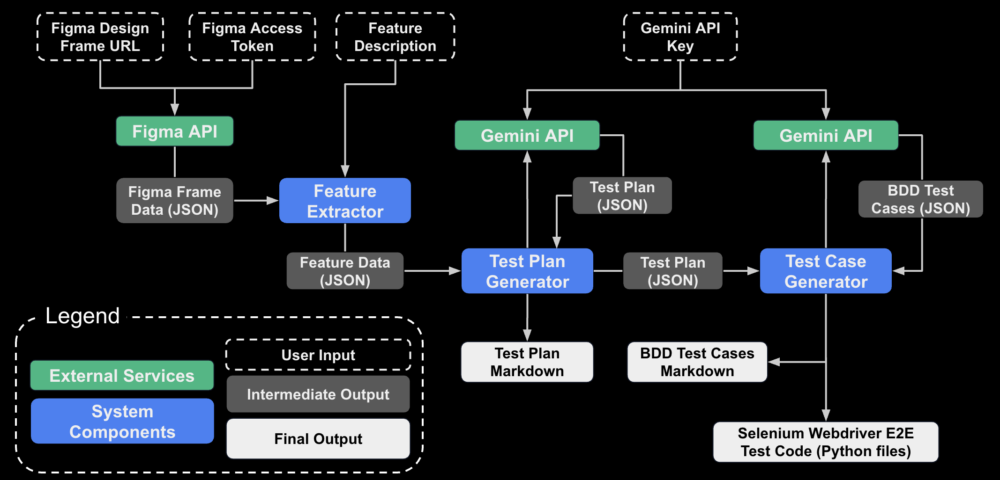

# 
# Figma UI Test Planner

### An AI-Powered Solution that generates `Test Plans and Test Cases from Figma UI designs`. 
#### Provided by `CoverIQ`.

## Features

- Interactive flow-based UI
- Real-time test plan generation from Figma designs
- Create BDD-style test cases
- Export test plans and test cases in Markdown format
- Export test cases in .feature file format to start coding automated E2E tests

## Prerequisites

- Python 3.9 or higher
- Node.js 18 or higher
- npm or yarn
- Figma Access Token
- Google Gemini API Key

## Installation

### Backend Setup

1. Navigate to the backend directory:
```bash
cd CoverIQ-BE
```

2. Create a virtual environment (optional but recommended):
```bash
python -m venv venv
source venv/bin/activate  # On Windows: venv\Scripts\activate
```

3. Install dependencies:
```bash
pip install -r requirements.txt
```

4. Start the backend server:
```bash
uvicorn main:app --reload
```

The backend server will run on `http://localhost:8000`

### Frontend Setup

1. Navigate to the frontend directory:
```bash
cd CoverIQ-FE
```

2. Install dependencies:
```bash
npm install
```

3. Start the development server:
```bash
npm run dev
```

The frontend will be available at `http://localhost:5173`

## Usage

1. Open your browser and navigate to `http://localhost:5173`
2. In the Feature Input node:
   - Enter your feature description
   - Paste your Figma URL
   - Click "Generate Test Plan"
3. The Test Plan node will display:
   - Generated test plan
   - BDD-style test cases
4. Download options:
   - Test plan in Markdown format
   - Test cases in Markdown format
   - Test cases in .feature file format

## System Workflow


## Contributing

1. Fork the repository
2. Create your feature branch (`git checkout -b feature/amazing-feature`)
3. Commit your changes (`git commit -m 'Add some amazing feature'`)
4. Push to the branch (`git push origin feature/amazing-feature`)
5. Open a Pull Request with detailed documentation on changes. 
6. Submit Pull Request and Assign/Notify a Reviewer

## License

This project is licensed under the MIT License - see the LICENSE file for details.